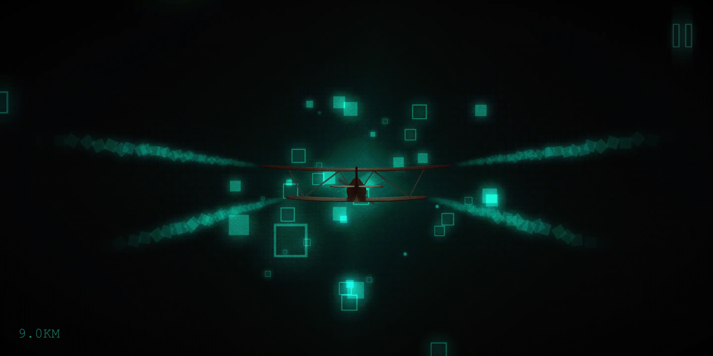

# Project: Flurry

---

*This repository is intended for educational purposes only.*

---

### 特性描述

1. 粒子效果（喷气、得分）
2. 光渲染
3. 碰撞检测
4. 障碍物（差集运算）
    https://threejs.org/examples/#webgl_clipping_intersection
    https://threejs.org/examples/#webgl_clipping_stencil
    https://threejs.org/examples/#webgl_geometry_shapes
5. 相机位置等
    https://ldr1-18716f-1302358347.tcloudbaseapp.com/editor/ （可以用作布置layout时的可视化）
6. 暂停接口 window blur
7. 减少竞技性和难度，更偏向纯粹舒缓的视觉类游戏

- scene、perspective camera
- static objects(基础隧道场景建模，飞机建模构造)
- dynamic objects(螺旋桨更新函数，场景行进感函数，粒子特效，喷气，雾气)
- light&shadow(光渲染、hemisphereLight、shadowLight、ambientLight)
- generate obstacles(位置、频率、变化、随机化)
- user control(输入设备处理，极端情况处理，屏幕大小适配，碰撞监测……)

### 流程规划

- [x] 基础文档撰写，Github库配置，统一开发环境，统一代码、commit规范
- [x] 收集文献资料，收集参考，寻找效果图，寻找竞品
- [ ] 完成Three.js基础场景搭建（scene、perspective camera、static objects、hemisphereLight、shadowLight）
- [ ] 完成user control
- [ ] 完成dynamic objects
- [ ] 完成generate obstacles
- [ ] 阶段测试，痛点分析，代码梳理，结构重整
- [ ] 完成:checkered_flag:

### To-do list

*请自己添加、删改任务。*

---

z1042117441: 

---

naiziguai: 

- [ ] 安装Document this插件，查看`规范.md`内的相关内容。
- [ ] 查看他人的commit历史

---

cloudres: 

- [ ] 完成web worker - audio开发 
    https://developer.mozilla.org/en-US/docs/Web/API/Web_Audio_API
    https://github.com/mrdoob/three.js/blob/master/src/audio/Audio.js
    https://threejs.org/docs/#api/en/audio/Audio
    https://developer.mozilla.org/en-US/docs/Web/API/AudioBufferSourceNode
    https://developers.google.com/web/updates/2018/11/web-audio-autoplay
    https://developer.mozilla.org/en-US/docs/Games/Techniques/Audio_for_Web_Games
    https://developer.mozilla.org/en-US/docs/Web/Guide/Audio_and_video_delivery/Web_Audio_API_cross_browser
    https://developers.google.com/web/updates/2017/12/audio-worklet
- [ ] 暂停函数、分数存储
- [ ] requestAnimationFrame
- [ ] indexedDB存储音频
- [ ] 帮助、Credit、全屏
- [ ] 强制横屏(maybe)
- [ ] vertices的概念

---

### Change log

- 09-12 init. 完成基本框架建设，完成团队组织。
- 09-15 The Aviator part1.js学习完成。
- 09-

### Credits

- [蓝飞互娱(kunpo)](https://kunpo.cc/) - [Loner](https://play.google.com/store/apps/details?id=com.kunpo.loner&hl=en_US) (Google Play)
- [Inner Peace Studio](https://soundcloud.com/innerpeacestudio) - [Loner Game Soundtrack](https://soundcloud.com/innerpeacestudio/sets/loner-game-soundtrack) (Soundcloud)
- [Three.js](https://github.com/mrdoob/three.js)
- 

